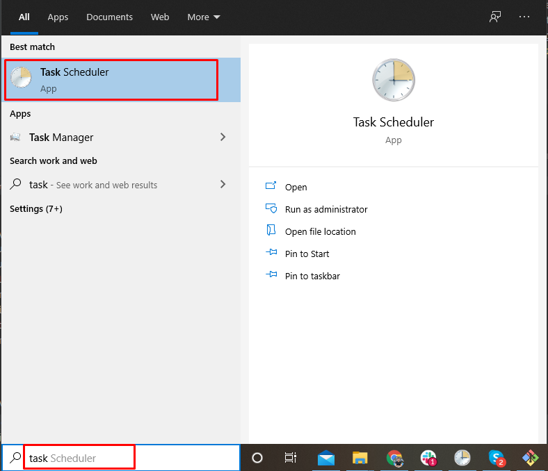

# Auto Log Time

## Installation instruction
1. Download the source code from the git repository https://github.com/phucdosts/AutoLogTime, 
   or you can download the .zip file + unzip it
   
   
2. Fill your username - password to login the insider portal and other data such as activity and project etc. in the 
   quote mark 

1. Download and install python from https://www.python.org/downloads/release/python-395/ or any version of python, 
  download the `Windows installer`
   
- Install python by clicking the option `Install Now`, remember to enable the checkbox `Add Python x.x to PATH`

  

2. Open the environment variables and make sure that you have the `Python Path` in the settings, 
  the path may be different due to your installation configuration 
  (check the installation path in the `Install Now` option to see the `Python Path`)

  
3. Open the cmd and check for Python and install `Selenium`

- Check if we install Python correctly by the command `python --version` and `pip --version`
- Install the selenium library with the command `pip install -U selenium`, 
  you can see the installed packages with the command `pip list`, it's required to have these 4 packages below

  
4. Set up window task scheduler
- Open the `Task scheduler`

- Create new task and give it a name

- Set a schedule

- Set up the action
- `Program/script` is the `Python path`, Eg: `C:\Users\phuc.do\AppData\Local\Programs\Python\Python39\python.exe`
- `Add arguments` is the `script name`, Eg: `main.py`
- `Start in` is the `AutoLogTime directory path`, Eg: `C:\Users\phuc.do\PycharmProjects\autolog`

